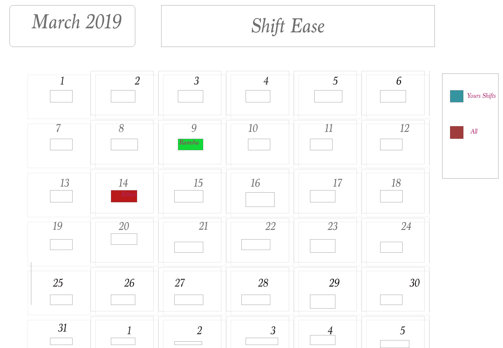
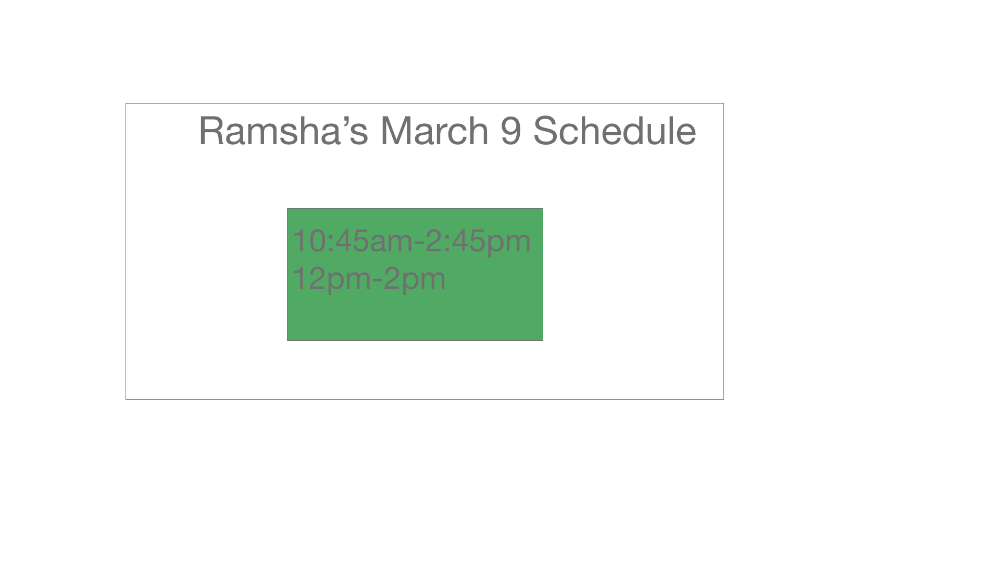

# Shiftease

## LUC COMP 330 Project 3 - Spring 2019

# 1. Introduction

## 1.1 Purpose

The purpose of Shiftease is to make the oftentimes long and arduous process of creating an employee scheduled quick, simple, and pain free. Shiftease automates schedule creation based on employee availability and provides a personalized monthly calendar view for employees and managers, giving employees and quick and easy way to see when they are working as well as managers a tool to rapidly see who is working when.

## 1.2 Document Conventions

When reading this document, large bolded section headings indicate breaks between different document sections whereas smaller bolded headings indicate the start of different subsections. The body of the subsection text is unbolded 12 point font. 

## 1.3 Intended Audience and Reading Suggestions

Our intended audience for Shiftease are managers or the like who are responsible for compiling shift availability given by their employeees into a monthly work schedule. Another part of the intended audience for Shiftease are employees looking for a fast way to check their montly work schedule which results in no confusion about the actual times they are scheduled to work. As Shiftease will integrate with Google Forms and Google Sheets, Shiftease may be even more desirable to managers who already use these services to gather availability data and create a schedule as the initial overhead when switching to this service will be very low. 

## 1.4 Product Scope

After logging into the application, both employees and managers will be presented with a monthly calendar view. When an employee logs in, days on the calendar when the employee logged in is scheduled to work will be populated with a Google Calendar like event which will show the shift they are scheduled to work. Readers can refer to appendix 1 for a better visual as to what this will look like. From the calendar view, employees can find links to Google Forms for submitting future availability as well as a tool that will easily allow them to search for other employees in the case that they need one of their shifts covered. When a manager logs in, they will be presented with a similar calendar view that will instead display all shifts for every day in the month. When clicked, this event will expand to show the employees currently assigned to this shift so the manager can easily see who should be showing up to work at a given time. From the calendar view the manager can navigate to the schedule creation page where they were be prompted through the automated scheduling process. Once a schedule is generated it will be stored and can be displayed on the calendar view at any time. A final page will allow for managers to make edits to the schedule without having to directly modify the schedule data itself. 

# 2 Overall Description

## 2.1 Product Perspective

Shiftease is a web application designed to help managers schedule employee work shifts in a proper and efficient, doing away with other convulated and more labor intensive ways of creating work schedules. A long term goal would be to make scheduling more efficent by adding more functionalities and views. 

## 2.2 Product Functions

Employee View:
- Employees are prompted to log into the service
- Employees are presented with a personalized pre-prepared calender populated with their work schedule data
- When looking through shift coverage, emnployees with be prompted through a the process to look up other employees they can contact for coverage
- A final page will present a series of links to Google Forms where users can submit their availability for the upcoming month, should that form already be created

Manager View: 
- Managers are prompted to log into the service
- Managers are presented with a pre-prepared calendar which shows the shifts for every day in the month
- On the create schedule page, managers will answer a few questions, enter exceptions/preferences before the schedule is generated
- On the edit schedule page, an interface will allow for easy editing of the schedule without direct manipulation of the underlying data

## 2.3 User Classes and Characteristics

This product can potentially benefit a variety of users, we will use the terminology of "employee" and "manager" for the two types of users, referring to a user who is scheduled for shifts and a user who shcedules shifts, respectively

   - managers: can make schedules and can view all employees' shifts 
   - employees: can provide availability and view either all employees' shifts or only their own

## 2.4 Operating Environment

This product will be designed to run in modern web browsers that support the most recent web standards and features. We anticipate that this service will run the best on browsers such as Google Chomre, Mozilla Firefox, and Safari. Older browsers may not support some of the features used in this service.

## 2.5 Design and Implementation Constraints

As this is a web service, an internet connection will be required. As this service uses Google Sheets heavily in the schedule building process, any disruption of access to that service could make the schedule creation feature temporarily unavailable.

## 2.6 User Documentation

As the automated schedule creation feature uses the output of a Google Form to a Google Sheet during the scheduling process, an example form will be provided to show managers how to strucutre a form to produce a Google Sheet that the scheduling function can correctly read from. The shift coverage function, schedule creation function, and the schedule editing process implementation are implemented in a self-documenting manner. If users need additional help however, a help page will explain how to use all the different functions of the site.

## 2.7 Assumptions and Dependencies

Requirements to run this software:
- A modern web browser such as Google Chrome, Firefox, or Safari
- Manager View: access to a Google account which contains a Google Sheet with the properly formatted availability data 

# 3 External Interface Requirements

## 3.1 User Interfaces

# 4 System Features

## 4.1 View Schedule

### 4.1.1 Description and Priority

Viewing the schedule is of high priority for Shiftease. In doing so, we allow both managers and employees to view current schedule for upcoming month.

### 4.1.2 Stimulus / Response Sequences

Viewing the schedule is largely static for the user, based purely on how the manager has made the schedule. That said, Employees can toggle between viewing only their shifts for the upcoming month or all employees' shifts.

## 4.2 Make Schedule

### 4.2.1 Description and Priority

Making the schedule is also of high priority for Shiftease. A preliminary manager setup will include setting all possible shift times and assigning types of shifts to different days. After that, our algorithm will construct a schedule based on employee availability information, and a manager may then make any modifications to the resulting schedule.

### 4.2.2 Stimulus / Response Sequences

Making the schedule will be triggered by the manager, given the existence of employee availability information. The manager may then add, remove, or change shifts for any and all individual employees.

## 4.3 Provide Availability

### 4.3.1 Description and Priority

Providing availability is of medium priority for Shiftease. This feature allows employees to input their availability directly into our application as opposed to an outside spreadsheet, removing the inconvenience of having multiple scheduling resources.

### 4.3.2 Stimulus / Response Sequences

An employee can provide availability information in the same style as Google Calendar, in which visual timeblocks represent possible shifts and indicated availability.

# 5 Other Nonfunctional Requirements

## 5.1 Performance Requirements

Our primary performance requirement is the speed and accuracy of the scheduling algorithm itself, resulting in minimum wait time after it is triggered by the manager and producing a schedule that requires minimal modification following creation. Furthermore, the UI should be clear and flow naturally, making explicit shift times and to whom they belong and smoothly transitioning between views.

## 5.2 Security Requirements

Users will be able to create a login id and password, which will be basically encrypted for initial use. Further security upgrades may be implemented when put into institutional use.

## 5.3 Software Quality Attributes

The Shiftease UI should feel natural and require minimal instruction for proper use. Shiftease will be testable, particularly in confirming data equivalence between different users. Shiftease will be published publicly with a distinct URL for user convenience.
